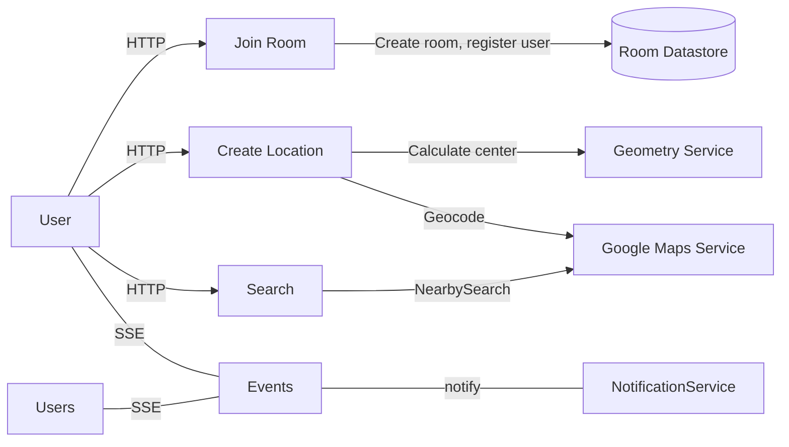

# Design

## Requirements

The site allows users to enter their locations on a map and search for places near a calculated center point.

- Users join a room by navigating to `/room/<id>`. Rooms are auto-created when a user joins with a new room ID.
- Users add locations by searching an address (geocoding) or sharing their current browser location.
- Users can delete their own locations.
- All users in a room see the same set of locations and search results in real-time.
- A user's locations are automatically deleted when they disconnect, e.g. refresh the page.
- The site calculates a central position from all locations. Search radius and type of venue, along with other search parameters, can be adjusted by the users.

## Assumptions / Constraints

- Users live within the same city.
- User data (locations, rooms, search results) are not preserved.
- No authentication: Rooms are open to anyone joining them.

## Architecture Overview

## Calculating the center

If there is one location, then it's the center. For two locations, the midpoint is the center. For three or more locations, a polygon is created from the points and the center position is its centroid.

Since the site expects to deal with short distances, using simple 2D geometry for distance calculations would be sufficient. However, I opted for the JavaScript library [turfjs](https://turfjs.org/); it provides accurate geospatial calculations and offers [alternatives](https://turfjs.org/docs/api/centerMedian) for calculating the center of a collection of points.

## Geocoding, search

The site uses the following APIs and services from Google Maps Platform:

- Maps JavaScript API: To load the map and places markers and shapes on it.
- Geocoding Service: To translate an address into geographic coordinates (longitude, latitude).
- Places API: For nearby places search, and loading Place information.

The search is performed within a radius from the calculated central point, the search parameters or filters depend on what is supported by Google Places API, which is quite flexible and fits the basic requirements.

Alternatives to Google Maps Platform could be:

- Open Street Map, to load the initial map.
- Nominatim: A geocoding service for OSM (open street map) data.

The Google Maps Platform has the richest Places database and provides reasonable free usage tier for a personal project. To prevent exceeding usage quotas, requests are rate-limited to 40/minute.

## Data Storage

Room information, users' locations and search results are stored in-memory and would be lost immediately on server restart or if the users disconnect from the server for any reason.

## Client-Server communication

Users share their locations by sending an HTTP request to the server, which then pushes it to all connected users using Server-Sent Events. When a user performs the search, the results are also pushed to connected clients using SSE.

Server-Sent Events provide unidirectional communication from server to clients. They are supported natively in browsers, work seamlessly with HTTP and don't require extra infrastructure overhead. An alternative is WebSockets; but that would add an extra dependency and unnecessary complexity in this use-case: When the user shares their location or performs search, it hits Google's HTTP APIs in the backend anyway, the extra latency there cannot be avoided, so it would add little value to share locations and search results using WebSockets, SSE are good enough.

HTTP polling is also an option, but it adds extra latency and increases server load, which can be avoided by SSE.

Here is a good [comparison document](https://www.index.dev/skill-vs-skill/socketio-vs-websockets-vs-server-sent-events) for the different technologies.

### Connection Lifecycle

If SSE disconnects temporarily, the connection to the server is closed permanently and the user is shown a message to refresh the page. User data is lost and a new connection needs to be established. This cleanup prevents increasing memory usage, since the data is stored in-memory on the server.

However, this behavior can be improved by queuing the cleanup to be run after X minutes, allowing the user time to reconnect in case they exited temporarily or by accident.

## API Library

This project requires a simple REST API that supports an SSE endpoint. I chose fastify for its built-in schema validation and rich plugin ecosystem. NestJS would have been overkill, and Express.js would have also worked but with slightly more effort.

## Request Validation

When a user joins a room, the server sets an HTTP read-only cookie with a generated user ID, and signs it using a server session secret.

This simple mechanism is used to validate location deletion requests, since users are allowed to delete only their own locations.

## Frontend

The frontend relies on the Google Maps JavaScript API to load a map and draw markers and shapes on it. Since it was a simple UI and requires simple element interactions, using Vanilla JS was good enough.
