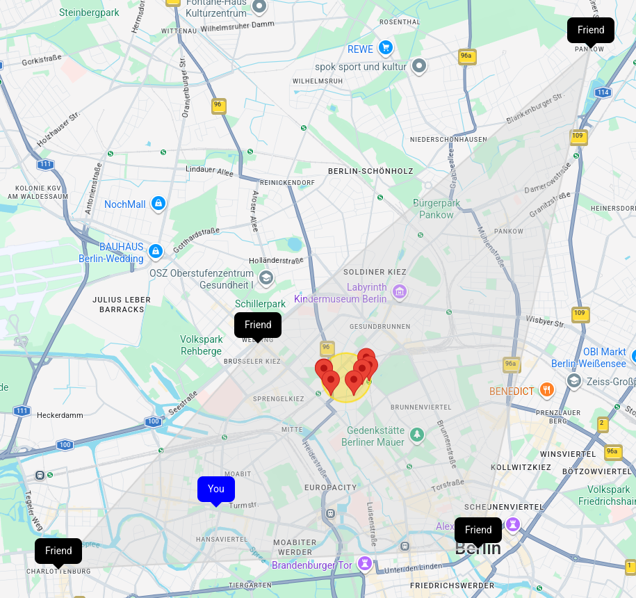

# nearby-places

A collaborative map application for finding central meeting places between multiple people. Designed for short distances within a city.



## Usage

View a demo of the project at: https://places.n0ur.dev

- Enter a room, which is a shared map page for your group, you can share it with others and it will update in real time.
- Set your location either by entering an address or with GPS.
  - You can enter as many locations as you like.
  - No need to enter the exact address, partial or generic addresses can still be geocoded.
- Delete a location by clicking on the location marker, which opens a window with the "Delete" button.
- The "Search places" tab shows a yellow circle in the center where the search will be performed. You can change the radius and venue type to search. You might have to increase the radius if no places were found.
- The places found are shown as red markers, click on any of them for details.

## Setup

To run locally or self-host:

- Clone the repository
- Copy `env.template` to `.env` and set the missing environment variables:
  - an API key from [Google Maps Platform](https://developers.google.com/maps/documentation/javascript/get-api-key). Add restrictions to prevent unauthorized access, which can be done in the GCP / APIs & Services / Credentials.
  - a session secret, which you can generate & copy to the clipboard with:
    ```
    openssl rand -base64 40 | xclip -r -selection clipboard
    ```
- Install dependencies with `npm i`
- Start the server with `node --env-file .env src/index.js`

## Design

For an architecture overview, assumptions and constraints see the [Design](./DESIGN.md) document.

## Future Improvements

- [x] Improve the zoom behavior
- [x] Add a cleanup queue, which would allow users to retain data if temporarily disconnected.
- [ ] Perform search automatically on location or parameter change
- [x] Batch search requests and allow cancellation.
- [ ] Add address autocomplete
- [ ] Import/export location data.
- [ ] Use the new Places API
- [ ] Extend search params
